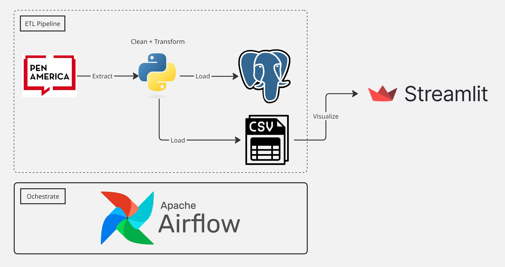

# Banned Books ETL Pipeline

This project was the capstone project I've done in DataTribe Collective's Capstone Project which demonstrates how to ochestrate the process of scraping PEN America website for banned books data, cleaning and transforming the data, then loading them to CSV files. The data then illustrated using Streamlit.

## Tools

- Python (3.12)
- Pandas
- Airflow (3.0.0+)
- Streamlit
- PostgreSQL
- Neon

---

## Project Flow

1. Scrape banned books data using Python
2. Clean data using Pandas
3. Extract data to CSV
4. Save data to Neon DB
5. Visualize data in Streamlit




---

## Project Structure
```
VincentLeV/
├── app/
│   ├── data/
│   │   └── banned_books/
│   │       ├── banned_books.csv     # The main dataset that is used for visualization
│   │       └── ...
│   ├── app.py                       # Streamlit home page 
│   ├── ...    
│   └── Dockerfile
├── config/
│   ├── generate_pgadmin_server.py   # Make sure that the server is ready in PgAdmin
│   └── ...
├── dags/
│   └── get_banned_books.py          # Airflow DAG that handles the data processing process
├── tasks/
│   └── banned_books_taks.py         # Airflow tasks that are used in get_banned_books DAG
├── utils/
│   ├── constants.py                 # Common constants that are used in util functions/tasks/DAG
│   └── transform_banned_books.py    # Util functions that handle clean and transform the data
├── docker-compose.yaml
├── start.sh                         # App start script
└── stop.sh                          # App end script
```

## Data Visualization

Streamlit app is deployed here

```
https://banned-books-us.streamlit.app/
```

## Setup and Run Locally

### For Running the Project the First Time

1. In the terminal, run these commands
   ```bash
   ./start.sh
   ```

   The terminal will prompt for some variable inputs, please type in the values as you want
2. After Docker has completed the process, navigate to check out Airflow processes:
   ```
   http://localhost:8080/
   ```
3. If everything runs well in step 2, the data is ready, navigate to this page to check out the visualization:
   ```
   http://localhost:8502/
   ```

For curiousity, the data in PostgreSQL can be checked here
```
http://localhost:5050/
```

PgAdmin is pre-loaded with a server under the name that you input for this prompt `Enter pgadmin server name`

Log into the DB with the password you provide in this prompt `Enter postgres password`, you will see that the data after this

### For Running the Project Not the First Time

In the terminal, run these commands
```bash
docker compose up -d
```

## Stop the app

In the terminal, run this script
```bash

./stop.sh
```